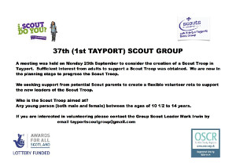
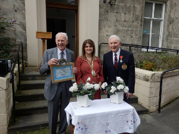
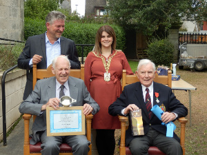
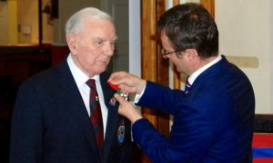

<!-- <a href="http://tayport.org.uk/#site-navigation">jump to Site Navigation</a> -->
<a href="http://tayport.org.uk/#local-news">jump to Local News</a>

## Upcoming Events

## Local News

[welcome to fife tentsmuir forest outdoor cinema](http://tayport.org.uk/pdfs/2020-welcome-to-fife-tentsmuir-forest-outdoor-cinema.pdf)

---
[TCC Minutes of 2nd December 2019](http://tayport.org.uk/pdfs/2019-12-02-TCC-Minutes.doc)

---
[TCC Minutes of 7th October 2019](http://tayport.org.uk/pdfs/2019-10-07-TCC-Minutes.doc)

---
[Tayview Medical Practice Newsletter](http://www.mysurgerywebsite.co.uk/website/F21609/files/newsletter.pdf)

---
[TCC Minutes of 1st July 2019](http://tayport.org.uk/pdfs/2019-07-01-TCC-Minutes.doc)

---
[TCC Minutes of 3rd June 2019](http://tayport.org.uk/pdfs/2019-06-03-TCC Minutes.doc)

---
[TCC AGM Minutes of 6th May 2019](http://tayport.org.uk/pdfs/2019-TCC-AGM-Minutes-of-6th-May-2019.doc)

---
[TCC AGM Agenda for 6th May 2019](http://tayport.org.uk/pdfs/2019-TCC-AGM-Agenda-for-6th-May.doc)

---
[TCC Minutes of 1st April 2019](http://tayport.org.uk/pdfs/20190401-TCC-Minutes.doc)

---
[TCC Minutes of 4th March 2019](http://tayport.org.uk/pdfs/2019-03-04-TCC-Minutes.doc)

---
[TCC Minutes of 4th February 2019](http://tayport.org.uk/pdfs/2019-02-04-TCC-Minutes.doc)

---
[TCC Minutes of 5th November 2018](http://tayport.org.uk/pdfs/2018-11-05-TCC-Minutes.pdf)

---
Tayport FC’s New Programme Archive

Tayport Football Club has been issuing programmes for most home matches since the early 1990s and every one of these programmes plus some issued in the club’s amateur days is now available on a new website [www.tayportfcarchive.com](http://www.tayportfcarchive.com/)

It’s a comprehensive Archive of 435 programmes which have been digitised by staff at the University of St Andrews Library.

Through the medium of these matchday programmes the Archive traces the fortunes of Tayport FC during its hugely successful period in Junior Football from 1990 to the present day, playing matches against almost 100 different clubs.
It’s a period in which the club made six Scottish Junior Cup Final appearances, winning three, won two East Region Super League titles, two Premier League titles, nine Tayside Championships and thirty two local and regional cup competitions. 

It’s a veritable cornucopia of Junior football nostalgia with a good measure of community interest thrown in.

Tayport FC would be pleased to receive any comments or answer any questions relating to the Archive. 

Contact us on: tayportfcarchive@gmail.com

---
[A New Year message from Tayport Scouts](http://tayport.org.uk/media/20190101-tayport-scouts.jpg)

---
[TCC Minutes of 1st October 2018](http://tayport.org.uk/pdfs/2018-10-01-TCC-Minutes.pdf)

---
[TCC Minutes of 3rd September 2018](http://tayport.org.uk/pdfs/2018-09-03-TCC-Minutes.pdf)

---
[TCC Minutes of 2nd July 2018](http://tayport.org.uk/pdfs/2018-07-02-TCC-Minutes.pdf)

---
Citizen of the Year  
[2018 citizen-of-the-year-poster](http://tayport.org.uk/media/2018-citizen-of-the-year-poster4.jpg)  
[2018 citizen-of-the-year-poster-nominees](http://tayport.org.uk/media/2018-citizen-of-the-year-poster-nominees.jpg)

---
[Fun, Free Outdoor Activities on Offer to Thousands of Dundee Residents with the return of ParkLives](http://www.leisureandculturedunde

---
[TCC AGM Minutes of 7th May 2018](http://tayport.org.uk/pdfs/2018-05-07-TCC-AGM-Minutes.pdf)

---
[Reserve Newsletter No.38 - June 2018](http://tayport.org.uk/pdfs/2018-06-Reserve-Newsletter-No-38.pdf)

---

---
[TCC Minutes of 2nd April 2018](http://tayport.org.uk/pdfs/2018-04-02-TCC-Minutes.pdf)

---
[TCC Minutes of 5th March 2018](http://tayport.org.uk/pdfs/2018-03-05-TCC-Minutes.pdf)

---
[TCC Minutes of 5th February 2018](pdfs/2018-02-05-TCC-Minutes.pdf)

---
[TCC Minutes of 4th December 2017](pdfs/2017-12-04-TCC-Minutes.pdf)

---
[Tayview Medical Practice Newsletter](pdfs/2018-01-02-practice-newsletter.pdf)

---
[Exciting News From The Tayport Scout Group](pdfs/2017-12-11-tayport-scouts-news-item.pdf)

---
[TCC Minutes of 6th November 2017](pdfs/2017-11-06-TCC-Minutes.pdf)

---
The 37th Fife (1st Tayport) Scout Group are pleased to announce the formation of a new Scout Troop.

Commencing on Monday 15th January 2018, the new Scout Troop is open to all young persons between 10 1/2 - 14 years of age.

Make new friends; have fun; learn exciting things. Scouting is all about enjoying yourself - and there will always be plenty to do!

Register your interest now by email or Facebook. See [poster](pdfs/2017-11-22-Scout-Troop-New.pdf) for details.

---
[Tim Brett’s Report - Tayport Community Council Meeting - Monday 6 November 2017](pdfs/2017-11-06-Tayport-CC.pdf)

---
[TCC Minutes of 2nd October 2017](pdfs/2017-10-02-TCC-Minutes.pdf)

---
Tayport Scout Troop: We are now in a position to look at the refurbishment of the exterior of the Scout Hall. This will allow us to improve the facilities we provide as well as allowing us to develop new services. It is important that the community has a say in how we take this forward and we would be grateful if you would take a few minutes to complete the attached survey. This should take no longer than 2 minutes to complete. [https://www.surveymonkey.co.uk/r/8WBJZWY](https://www.surveymonkey.co.uk/r/8WBJZWY)

---
Creation of New Scout Troop In Tayport

---
[TCC Minutes of 4th September 2017](pdfs/20170904-TCC-Minutes.pdf)

---
The Community Council has restablished the Citizen of the Year and the first well deserved recipient, voted for by the people of Tayport, is Mr Jim Kinnear who has served the community for over 40 years.

The Community Council also commended Mr Irvine Rae recognising his prestigious award of the Legion D'honeour. A young swimmer Dylan Thorburn was also recognised for his gold and silver medals at the 20017 special olympics.
          

          
---
[Tim Brett' CC meeting report of 4th September 2017](pdfs/2017-09-04-tayport-cc-tim-brett-report.pdf)

---
[TCC Minutes of 3rd July 2017](pdfs/2017-07-03-TCC-Minutes.pdf)

---
[What Next For Cubs And Brownies?](<a href="pdfs/2017-08-29-cubs-brownies.pdf)

The Leaders of our respective Brownies and Cub Scouts have long recognised that we have been over reliant on our neighbouring Guides and Scout troops to support the young people of Tayport in the 10-14 year age group.

It is planned to hold a meeting on Monday 25th September in the Scout Hall at 7.30pm to explore forming a Scout troop in Tayport.  We would welcome parents or anyone with a interest in this community initiative to attend.

Why a scout troop?  The Scouts are the only uniform group that welcomes both girls and boys and allows us to pool resources to provide an outlet for our young people.  It will allow those moving on from the Brownies and Cubs to the next stage of their adventure.

Please join us on Monday 25th September or if you can't join us we would welcome your input either by email or on our respective Facebook pages.

---
[TCC Minutes of 5th June 2017](pdfs/20170605_TCC_Minutes.pdf)

---
Tayport man Irvine Rae receives Legion d’honneour (Dundee Courier)

<a href="https://www.thecourier.co.uk/fp/news/local/fife/464146/fife-d-day-veteran-awarded-the-french-legion-dhonneur/">Fife D-Day veteran awarded the French Légion d’honneur</a>

---
A great wet weather alternative – Join the Library

<strong>Joining the library is absolutely free, and kids can join at any age, even from birth!</strong>

We have lots ON for kids at your local library, including:
<ul>
  <li>A great selection of free books for all ages</li>
  <li>Dedicated sections for Tots, Children &amp; Teens</li>
  <li>Free public access PCs with internet and printing (small charge)</li>
  <li>A diverse range of talking books on CD and MP3</li>
  <li>DVDs for hire at a small charge, from Hollywood blockbusters to family classics</li>
  <li>Online library catalogue</li>
  <li>Free interlibrary loans from any branch in Fife</li>
  <li>Everything can be borrowed for up to three weeks, ask us if you need a book for longer</li>
  <li>Events, author visits, competitions and activities – ask the staff or look out for posters</li>
  <li>Join a Book Group coming soon from Chatterbooks</li>
  <li>Take part in Bookbug  sessions or join the Bookbug Challenge</li>
</ul>
          

---
Tentsmuir National Nature Reserve Newsletter

<a href="pdfs/Reserve-Newsletter-No-37-June-2017-1.pdf">Reserve-Newsletter-No-37–June-2017</a>

---
<a href="pdfs/TCC_AGM_Minutes_of_15th_May_2017.pdf">TCC AGM Minutes of 15th May 2017</a>

---
<a href="pdfs/20170403_TCC_Minutes.pdf">TCC Minutes for 3rd April 2017</a>

<!--
Click on the map below to link to multimap.co.uk where you can use its interactive features to zoom in and out.

-->

